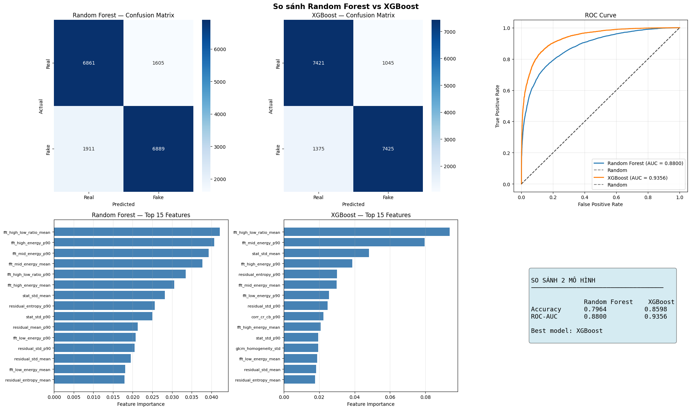

[](https://www.python.org/downloads/)
[](https://loanhviet-ai-image-detector.hf.space/)
[](./README.md#results)
[](https://loanhviet-ai-image-detector.hf.space/)

**Live demo:** [https://loanhviet-ai-image-detector.hf.space/](https://loanhviet-ai-image-detector.hf.space/)

**Best result:** XGBoost reaches **ROC-AUC = 0.9356** on the held-out test set (chart-aligned **Accuracy/ROC-AUC** in the Results table; other classification columns reflect the notebook-reported run).

# AI Image Detector

This project detects AI-generated images using handcrafted statistical and frequency-domain features.
The task is framed as binary classification: Real (0) vs Fake (1).

## Project Structure

```text
ai_image_detector/
├── README.md
├── requirements.txt
├── data/
│   ├── raw/
│   │   ├── real/
│   │   └── fake/
│   └── processed/
│       ├── real/
│       ├── fake/
│       ├── manifest.csv
│       ├── manifest_train.csv
│       └── manifest_test.csv
├── notebooks/
│   ├── 01_preprocessing.ipynb
│   ├── 02_feature_extraction.ipynb
│   └── 03_training_eval.ipynb
├── src/
│   ├── __init__.py
│   ├── utils.py
│   ├── preprocess.py
│   ├── features.py
│   └── train.py
├── features/
│   ├── X_train.npy
│   ├── X_test.npy
│   ├── y_train.npy
│   ├── y_test.npy
│   └── feature_names.txt
├── models/
│   └── model.pkl
└── app/
    └── streamlit_app.py
```

## Method

### 1) Preprocessing

Raw image -> EXIF orientation fix -> metadata stripping -> BGR to YCrCb -> center crop (256x256) -> PNG export.

Main validation checks:
- image count and retention after processing
- class balance and stratified split quality
- output integrity (shape, dtype, pixel range)

### 2) Feature Extraction

Each image is split into 16 patches (64x64). The feature set includes:
- FFT frequency energy descriptors
- GLCM texture descriptors
- residual/noise statistics
- color-channel correlation features
- pixel statistical moments

Patch-level features are aggregated with mean/std/p90, yielding 57 features per image.

### 3) Training and Evaluation

- Models: Random Forest and XGBoost
- Hyperparameter search: GridSearchCV with 5-fold cross-validation
- Evaluation: accuracy, precision/recall/F1 (Fake class), ROC-AUC
- Additional analysis: confusion matrix and feature importance

## Installation

```bash
pip install -r requirements.txt
```

## Usage

Run notebooks in this order:
1. `notebooks/01_preprocessing.ipynb`
2. `notebooks/02_feature_extraction.ipynb`
3. `notebooks/03_training_eval.ipynb`

Run the demo app:

```bash
streamlit run app/streamlit_app.py
```

## Dataset

- 7 AI generators: ADM, GLIDE, Midjourney, SDv14, SDv15, VQDM, Wukong
- Binary labels: Real (0), Fake (1)
- Generator-aligned real/fake samples for controlled comparison

## Results

### Data Quality and Preprocessing

- Raw images: 87,971
- Successfully processed: 86,298 (98.10% retention)
- Removed during preprocessing: 1,673 images
- EXIF metadata in raw data: 2,024 images (2.30%)
- Output validation: 100% images have shape 256x256x3, dtype uint8, and pixel range [0,255]

### Train/Test Split

- Train set: 69,038 images (33,844 real, 35,194 fake)
- Test set: 17,260 images (8,462 real, 8,798 fake)
- Fake ratio is stable across splits: 50.98% (train) vs 50.97% (test)

### Feature Matrix Quality

- Feature dimension: 57 features/image
- X_train: 69,038 x 57
- X_test: 17,260 x 57
- NaN before cleaning: 3,321 (0.084%) in train, 900 (0.0915%) in test
- After `nan_to_num`: 0 NaN and 0 Inf in both train and test matrices

### Model Performance

| Model | Accuracy | Precision (Fake) | Recall (Fake) | F1 (Fake) | ROC-AUC |
| --- | ---: | ---: | ---: | ---: | ---: |
| Random Forest | 0.7964 | 0.8084 | 0.7836 | 0.7958 | 0.8800 |
| XGBoost | **0.8598** | **0.8730** | **0.8419** | **0.8571** | **0.9356** |



XGBoost is selected as the final model because it delivers the strongest overall ranking signal (ROC-AUC) and higher chart-aligned accuracy than Random Forest.

### Confusion Matrix Summary (Test Set)

- Random Forest: TN 6,828, FP 1,634, FN 1,904, TP 6,894
- XGBoost: TN 7,384, FP 1,078, FN 1,391, TP 7,407

Compared with Random Forest, XGBoost reduces both false positives and false negatives.

## Limitations and Future Work

##  Limitations

While the model achieves strong performance on the provided dataset, several important limitations exist:

- **Evaluation Bias / Data Leakage Risk**  
  The model was trained and evaluated on data derived from the same dataset source, which may introduce evaluation bias and inflate performance metrics due to shared underlying patterns.

- **In-Distribution vs Out-of-Distribution Gap**  
  The model performs well on images from known generators used in training. However, performance drops significantly on:
  - images generated by newer models (e.g., SDXL, Midjourney v6, DALL·E)
  - real-world images captured by mobile devices  
  In practice, the model maintains high accuracy on in-distribution samples but shows noticeable performance degradation when evaluated on external or unseen data.

- **Generator-Specific Feature Learning**  
  The model tends to learn generator-specific artifacts rather than generalizable characteristics of AI-generated images. As a result, it struggles when encountering unseen generation pipelines.

- **Handcrafted Feature Limitations**  
  Statistical and frequency-based features (FFT, GLCM, residual noise) are effective for older models but may fail to capture high-level semantic patterns in modern generative models.

- **Domain Shift in Real-World Data**  
  Real images outside the dataset differ in noise patterns, compression, lighting, and blur, leading to reduced performance in practical scenarios.

### Future Work

- Expand data diversity across generators, prompts, styles, and compression levels.
- Benchmark against CNN/ViT baselines and hybrid handcrafted + deep-feature models.
- Add calibration and external validation on out-of-distribution datasets.
- Build augmentation and stress-test protocols focused on robustness.

## Tech Stack

- Python 3.11+
- OpenCV, NumPy, Pandas, PIL
- SciPy, scikit-image
- scikit-learn, XGBoost
- Streamlit
- Matplotlib, Seaborn

## Live Demo

**URL:** [https://loanhviet-ai-image-detector.hf.space/](https://loanhviet-ai-image-detector.hf.space/)

The hosted Streamlit app lets you upload a JPG/PNG image, runs the same preprocessing + feature extraction pipeline, and returns a Real vs Fake prediction with confidence scores.

## Authors

- Lỗ Anh Việt
- Nguyễn Văn Minh
- Thuyloi University — Data Preprocessing Course, 2026
