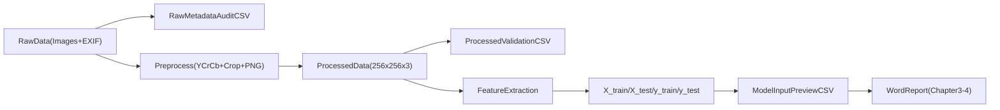

# Danh sach artifact cho bao cao (Chuong 3-4)

Tai lieu nay tong hop cac bang/hinh can chen vao Word de trinh bay ro luong du lieu:
`raw -> processed -> model input`.

## 1) Thu tu chen vao Word

1. Bang 3.1 - Thong ke metadata du lieu RAW
2. Hinh 3.1 - Phan phoi kich thuoc anh RAW
3. Bang 3.2 - So sanh truoc/sau tien xu ly
4. Bang 3.3 - Validation du lieu processed
5. Bang 3.4 - Snapshot du lieu dau vao mo hinh
6. Bang 3.5 - Tong quan shape va phan bo nhan train/test

## 2) Nguon du lieu cho tung bang/hinh

- Bang 3.1 (RAW metadata):
  - File: `data/processed/raw_metadata_audit.csv`
  - Cot chinh: `has_exif`, `exif_make`, `exif_model`, `exif_software`, `exif_orientation`.

- Hinh 3.1 (kich thuoc RAW):
  - Lay tu notebook 01, section EDA kich thuoc (Width/Height histogram).

- Bang 3.2 (before/after):
  - File: `data/processed/before_after_comparison.csv`

- Bang 3.3 (processed validation):
  - File: `data/processed/processed_validation.csv`
  - Cot chinh: `is_shape_256_256_3`, `is_uint8`, `is_range_0_255`.

- Bang 3.4 (model input snapshot):
  - File: `features/csv_exports/X_test_preview_500.csv`
  - Co the lay 5-10 dong dau de chen vao Word.

- Bang 3.5 (summary train/test):
  - File: `features/csv_exports/model_input_summary.csv`

## 3) Doan mo ta mau cho Chuong 3

### 3.x Du lieu truoc tien xu ly

Du lieu RAW duoc thu thap tu nhieu nguon va generator khac nhau, do do co su khong dong nhat ve kich thuoc, dinh dang, va metadata. Ket qua audit cho thay mot phan anh co EXIF chua cac truong nhu `Make`, `Model`, `Software`, `Orientation`. Neu dua truc tiep cac truong nay vao pipeline hoc may, mo hinh co the hoc sai huong (metadata leakage) thay vi hoc dac trung thi giac.

### 3.y Du lieu sau tien xu ly

Sau tien xu ly, anh duoc chuan hoa ve kich thuoc `256x256x3`, chuyen sang khong gian mau YCrCb, luu duoi dang PNG lossless, dong thoi loai bo anh huong metadata trong qua trinh trich xuat dac trung. Bang validation cho thay da so (hoac toan bo) mau dat cac dieu kien: shape dung, `dtype=uint8`, va pixel range nam trong `[0,255]`.

### 3.z Du lieu truoc khi mo hinh hoc

Tap anh processed duoc chuyen thanh ma tran dac trung so (`X_train`, `X_test`) cung nhan (`y_train`, `y_test`). De phuc vu trinh bay, cac file preview CSV da duoc xuat de minh hoa ro rang cau truc dau vao: 1 dong ung voi 1 anh, gom metadata toi thieu + nhan + vector dac trung.

## 4) Sơ do luong du lieu

